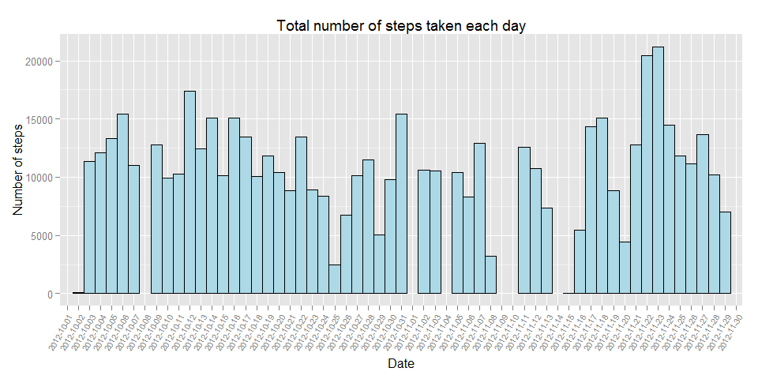
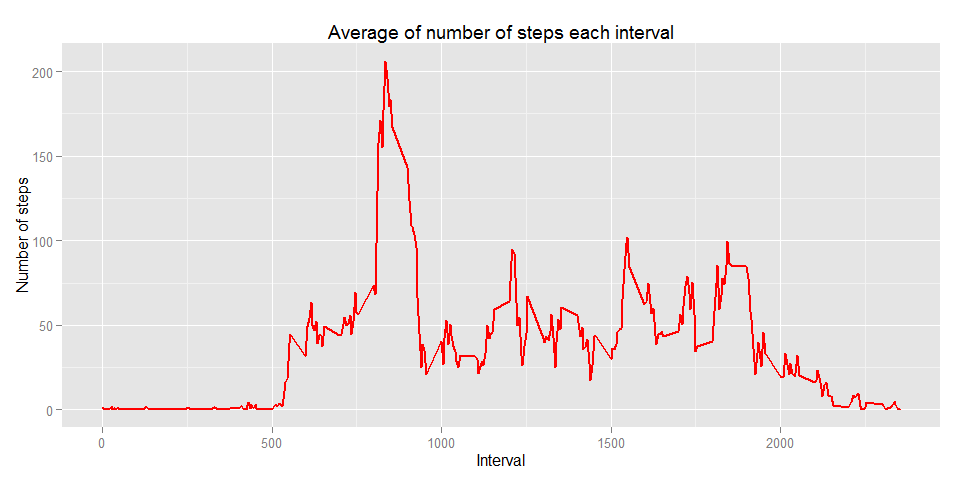
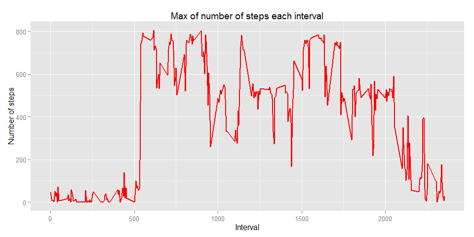
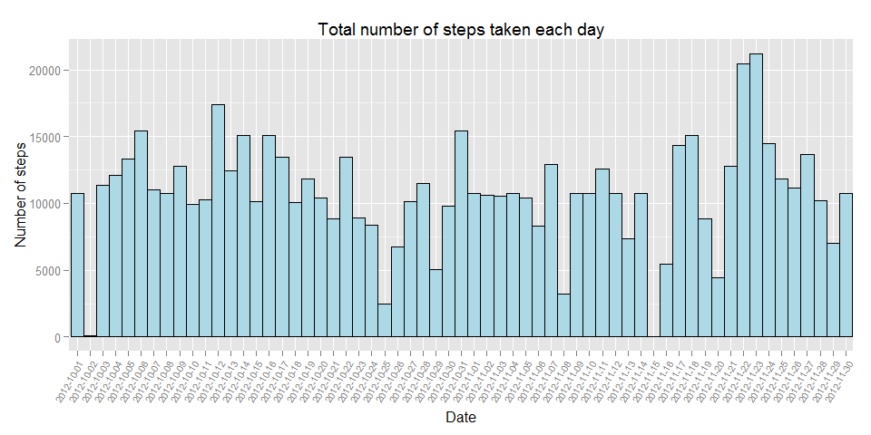
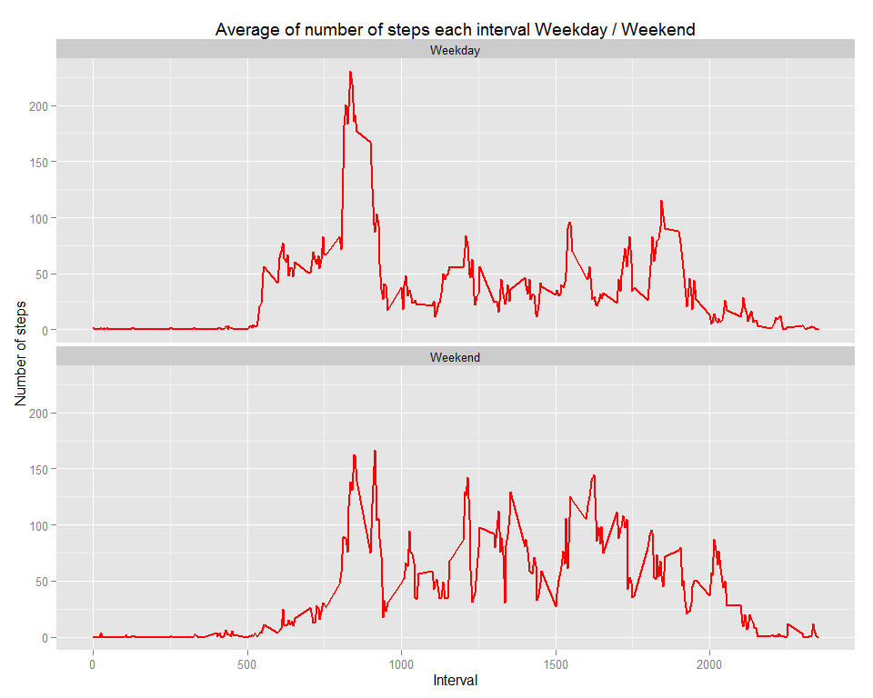

# Reproducible Research: Peer Assessment 1


## Loading and preprocessing the data


```r
library(dplyr)
activity<-tbl_df(read.csv(file = "activity.csv"))
```

## What is mean total number of steps taken per day?

Total number of steps taken per day


```r
steps_by_date<-summarise(group_by(activity,date), sum_steps=sum(steps))
print(steps_by_date,n=10e5)
```

```
## Source: local data frame [61 x 2]
## 
##          date sum_steps
## 1  2012-10-01        NA
## 2  2012-10-02       126
## 3  2012-10-03     11352
## 4  2012-10-04     12116
## 5  2012-10-05     13294
## 6  2012-10-06     15420
## 7  2012-10-07     11015
## 8  2012-10-08        NA
## 9  2012-10-09     12811
## 10 2012-10-10      9900
## 11 2012-10-11     10304
## 12 2012-10-12     17382
## 13 2012-10-13     12426
## 14 2012-10-14     15098
## 15 2012-10-15     10139
## 16 2012-10-16     15084
## 17 2012-10-17     13452
## 18 2012-10-18     10056
## 19 2012-10-19     11829
## 20 2012-10-20     10395
## 21 2012-10-21      8821
## 22 2012-10-22     13460
## 23 2012-10-23      8918
## 24 2012-10-24      8355
## 25 2012-10-25      2492
## 26 2012-10-26      6778
## 27 2012-10-27     10119
## 28 2012-10-28     11458
## 29 2012-10-29      5018
## 30 2012-10-30      9819
## 31 2012-10-31     15414
## 32 2012-11-01        NA
## 33 2012-11-02     10600
## 34 2012-11-03     10571
## 35 2012-11-04        NA
## 36 2012-11-05     10439
## 37 2012-11-06      8334
## 38 2012-11-07     12883
## 39 2012-11-08      3219
## 40 2012-11-09        NA
## 41 2012-11-10        NA
## 42 2012-11-11     12608
## 43 2012-11-12     10765
## 44 2012-11-13      7336
## 45 2012-11-14        NA
## 46 2012-11-15        41
## 47 2012-11-16      5441
## 48 2012-11-17     14339
## 49 2012-11-18     15110
## 50 2012-11-19      8841
## 51 2012-11-20      4472
## 52 2012-11-21     12787
## 53 2012-11-22     20427
## 54 2012-11-23     21194
## 55 2012-11-24     14478
## 56 2012-11-25     11834
## 57 2012-11-26     11162
## 58 2012-11-27     13646
## 59 2012-11-28     10183
## 60 2012-11-29      7047
## 61 2012-11-30        NA
```

```r
library(ggplot2)

ggplot(steps_by_date, aes(date,sum_steps)) +
       geom_histogram(stat="identity",fill="lightblue", colour="black",width=1) +
       theme(axis.text.x = element_text(angle=60, hjust=1, vjust=1,size=rel(0.8)))+
       ylab ("Number of steps") +
       xlab ("Date")+
       ggtitle("Total number of steps taken each day")
```

 

Mean and median of the total number of steps taken per day

```r
options(digits = 2)
steps_by_date<-summarise(group_by(activity,date),
                         mean_steps= mean(steps,na.rm = TRUE),
                         median_steps=median(steps,na.rm = TRUE))

print(steps_by_date,n=10e5)
```

```
## Source: local data frame [61 x 3]
## 
##          date mean_steps median_steps
## 1  2012-10-01        NaN           NA
## 2  2012-10-02       0.44            0
## 3  2012-10-03      39.42            0
## 4  2012-10-04      42.07            0
## 5  2012-10-05      46.16            0
## 6  2012-10-06      53.54            0
## 7  2012-10-07      38.25            0
## 8  2012-10-08        NaN           NA
## 9  2012-10-09      44.48            0
## 10 2012-10-10      34.38            0
## 11 2012-10-11      35.78            0
## 12 2012-10-12      60.35            0
## 13 2012-10-13      43.15            0
## 14 2012-10-14      52.42            0
## 15 2012-10-15      35.20            0
## 16 2012-10-16      52.38            0
## 17 2012-10-17      46.71            0
## 18 2012-10-18      34.92            0
## 19 2012-10-19      41.07            0
## 20 2012-10-20      36.09            0
## 21 2012-10-21      30.63            0
## 22 2012-10-22      46.74            0
## 23 2012-10-23      30.97            0
## 24 2012-10-24      29.01            0
## 25 2012-10-25       8.65            0
## 26 2012-10-26      23.53            0
## 27 2012-10-27      35.14            0
## 28 2012-10-28      39.78            0
## 29 2012-10-29      17.42            0
## 30 2012-10-30      34.09            0
## 31 2012-10-31      53.52            0
## 32 2012-11-01        NaN           NA
## 33 2012-11-02      36.81            0
## 34 2012-11-03      36.70            0
## 35 2012-11-04        NaN           NA
## 36 2012-11-05      36.25            0
## 37 2012-11-06      28.94            0
## 38 2012-11-07      44.73            0
## 39 2012-11-08      11.18            0
## 40 2012-11-09        NaN           NA
## 41 2012-11-10        NaN           NA
## 42 2012-11-11      43.78            0
## 43 2012-11-12      37.38            0
## 44 2012-11-13      25.47            0
## 45 2012-11-14        NaN           NA
## 46 2012-11-15       0.14            0
## 47 2012-11-16      18.89            0
## 48 2012-11-17      49.79            0
## 49 2012-11-18      52.47            0
## 50 2012-11-19      30.70            0
## 51 2012-11-20      15.53            0
## 52 2012-11-21      44.40            0
## 53 2012-11-22      70.93            0
## 54 2012-11-23      73.59            0
## 55 2012-11-24      50.27            0
## 56 2012-11-25      41.09            0
## 57 2012-11-26      38.76            0
## 58 2012-11-27      47.38            0
## 59 2012-11-28      35.36            0
## 60 2012-11-29      24.47            0
## 61 2012-11-30        NaN           NA
```

## What is the average daily activity pattern?

```r
steps_by_interval<-summarise(group_by(activity,interval), 
                             mean_steps= mean(steps,na.rm = TRUE))

ggplot(steps_by_interval, aes(interval,mean_steps)) +
       geom_line(colour="red",size=1) +
       ylab ("Number of steps") +
       xlab ("Interval")+
       ggtitle("Average of number of steps each interval")
```

 

```r
max_steps_by_interval<-summarise(group_by(activity,interval), 
                            max_steps= max(steps,na.rm = TRUE))
```
Max of number of steps each interval

```r
ggplot(max_steps_by_interval, aes(interval,max_steps)) +
       geom_line(colour="red",size=1) +
       ylab ("Number of steps") +
       xlab ("Interval")+
       ggtitle("Max of number of steps each interval")
```

 

## Imputing missing values

Total number of missing values in the dataset

```r
sum(!complete.cases(activity))
```

```
## [1] 2304
```

Filling  missing values in the dataset with the mean of 5-minute interval

```r
activitynew <- activity  ## New dataset
for (i in 1:length(activitynew$steps)) {
          if (is.na(activitynew[i,"steps"]))
                 ## Assigned the  mean of 5-minute interval if steps = NA at new dataset 
                 activitynew[i,"steps"] <- select(filter(steps_by_interval, interval==as.integer(activitynew[i,"interval"])),mean_steps)    
                 
}
```
Total number of steps taken per day. Filling  missing values

```r
steps_by_date<-summarise(group_by(activitynew,date), sum_steps=sum(steps))


library(ggplot2)

ggplot(steps_by_date, aes(date,sum_steps)) +
       geom_histogram(stat="identity",fill="lightblue", colour="black",width=1) +
       theme(axis.text.x = element_text(angle=60, hjust=1, vjust=1,size=rel(0.8)))+
       ylab ("Number of steps") +
       xlab ("Date")+
       ggtitle("Total number of steps taken each day")
```

 
Mean and median of the total number of steps taken per day. Filling  missing values

```r
options(digits = 2)
steps_by_date<-summarise(group_by(activitynew,date),
                         mean_steps= mean(steps,na.rm = TRUE),
                         median_steps=median(steps,na.rm = TRUE))

print(steps_by_date,n=10e5)
```

```
## Source: local data frame [61 x 3]
## 
##          date mean_steps median_steps
## 1  2012-10-01      37.38           34
## 2  2012-10-02       0.44            0
## 3  2012-10-03      39.42            0
## 4  2012-10-04      42.07            0
## 5  2012-10-05      46.16            0
## 6  2012-10-06      53.54            0
## 7  2012-10-07      38.25            0
## 8  2012-10-08      37.38           34
## 9  2012-10-09      44.48            0
## 10 2012-10-10      34.38            0
## 11 2012-10-11      35.78            0
## 12 2012-10-12      60.35            0
## 13 2012-10-13      43.15            0
## 14 2012-10-14      52.42            0
## 15 2012-10-15      35.20            0
## 16 2012-10-16      52.38            0
## 17 2012-10-17      46.71            0
## 18 2012-10-18      34.92            0
## 19 2012-10-19      41.07            0
## 20 2012-10-20      36.09            0
## 21 2012-10-21      30.63            0
## 22 2012-10-22      46.74            0
## 23 2012-10-23      30.97            0
## 24 2012-10-24      29.01            0
## 25 2012-10-25       8.65            0
## 26 2012-10-26      23.53            0
## 27 2012-10-27      35.14            0
## 28 2012-10-28      39.78            0
## 29 2012-10-29      17.42            0
## 30 2012-10-30      34.09            0
## 31 2012-10-31      53.52            0
## 32 2012-11-01      37.38           34
## 33 2012-11-02      36.81            0
## 34 2012-11-03      36.70            0
## 35 2012-11-04      37.38           34
## 36 2012-11-05      36.25            0
## 37 2012-11-06      28.94            0
## 38 2012-11-07      44.73            0
## 39 2012-11-08      11.18            0
## 40 2012-11-09      37.38           34
## 41 2012-11-10      37.38           34
## 42 2012-11-11      43.78            0
## 43 2012-11-12      37.38            0
## 44 2012-11-13      25.47            0
## 45 2012-11-14      37.38           34
## 46 2012-11-15       0.14            0
## 47 2012-11-16      18.89            0
## 48 2012-11-17      49.79            0
## 49 2012-11-18      52.47            0
## 50 2012-11-19      30.70            0
## 51 2012-11-20      15.53            0
## 52 2012-11-21      44.40            0
## 53 2012-11-22      70.93            0
## 54 2012-11-23      73.59            0
## 55 2012-11-24      50.27            0
## 56 2012-11-25      41.09            0
## 57 2012-11-26      38.76            0
## 58 2012-11-27      47.38            0
## 59 2012-11-28      35.36            0
## 60 2012-11-29      24.47            0
## 61 2012-11-30      37.38           34
```

## Are there differences in activity patterns between weekdays and weekends?


```r
library(chron)
activitynew$week <- factor(is.weekend(activitynew$date),labels = c("Weekday","Weekend"))

steps_by_interval_w<-summarise(group_by(activitynew,interval,week), 
                             mean_steps= mean(steps,na.rm = TRUE))

ggplot(steps_by_interval_w, aes(interval,mean_steps,week)) +
       geom_line(colour="red",size=1) +
       ylab ("Number of steps") +
       xlab ("Interval")+
       facet_wrap( ~ week,ncol=1)+
       ggtitle("Average of number of steps each interval Weekday / Weekend")
```

 

